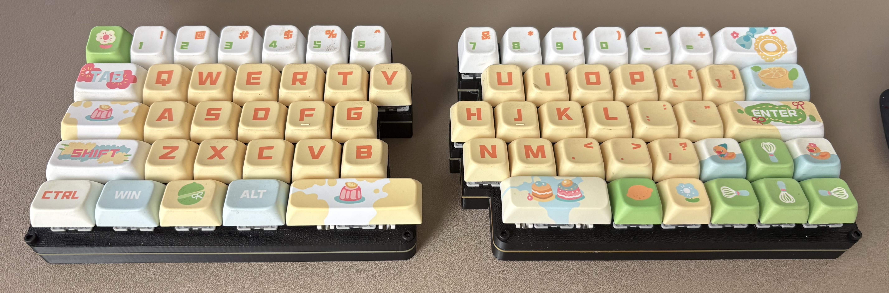
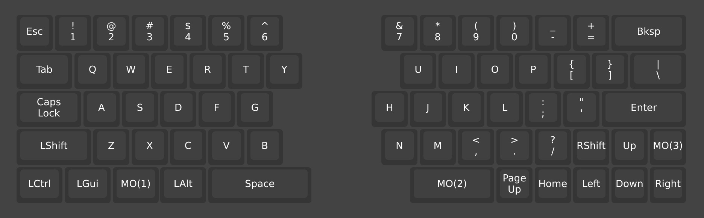
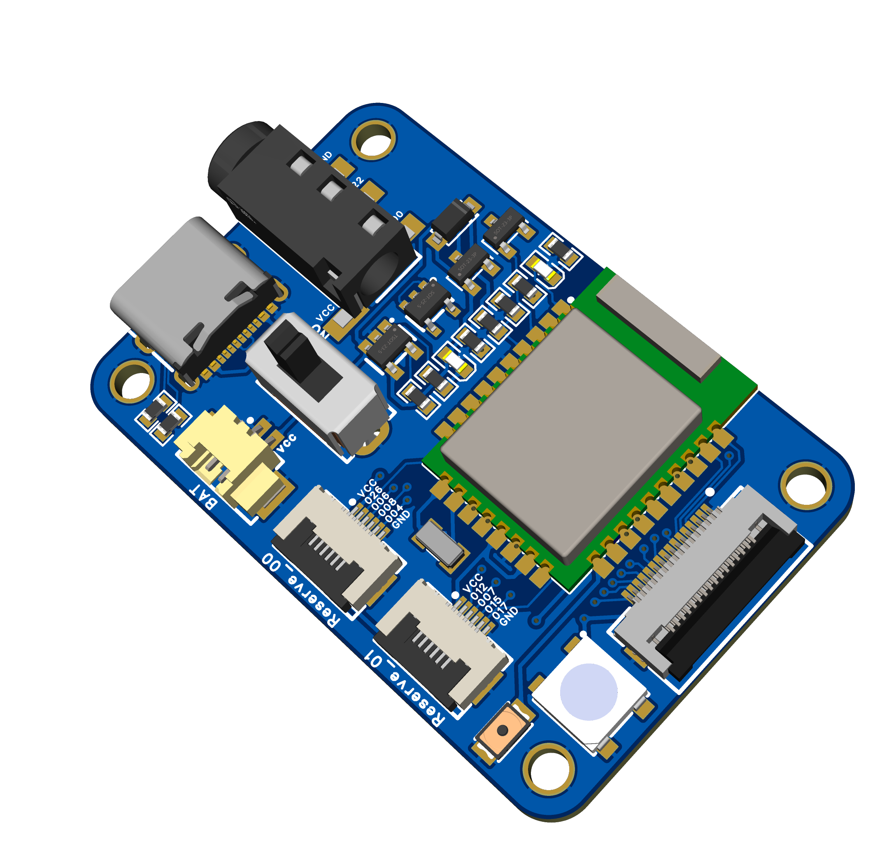

# zx66-keybord
My modular split 66-key keyboard

## Keyboard Layout

The hardware adopts a scheme where the keyboard and core are separated, with an FPC connecting them in the middle, facilitating the replacement of hardware and firmware to implement the scheme

## Core Board
### Nrf52840
Base by [nrfmicro](https://github.com/joric/nrfmicro)

- Hardware: see hardware folder "JiLiChuang_ZX66_2026-02-28.epro2"
- Firmware: [RMK](https://github.com/zongxin1993/zx66-rmk) and [ZMK](https://github.com/zongxin1993/zmk-config)